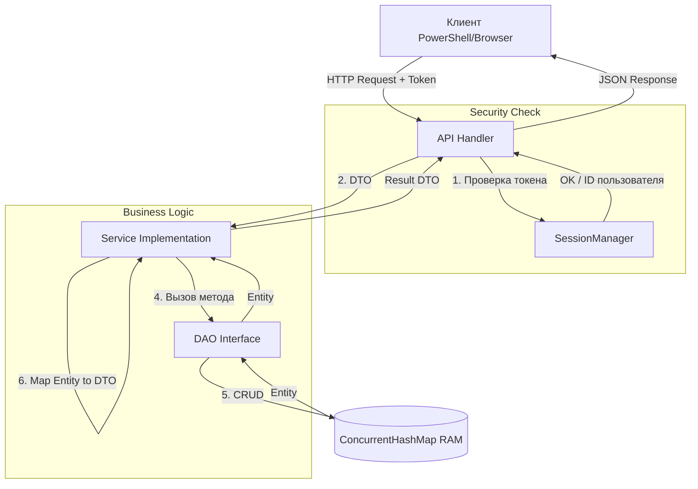

# Архитектура проекта GrantServer

**GrantServer** реализует многослойную архитектуру (Clean Architecture) с чётким разделением бизнес-логики, доступа к данным и API. Проект написан на чистой Java (No Libraries), имитируя работу Enterprise-систем.

## Архитектурные принципы

- **Inversion of Control (IoC):** Компоненты не создают зависимости сами, а получают их через централизованный реестр (`ServiceRegistry`).
- **Stateless API:** Сервер не хранит состояние разговора, каждый запрос содержит токен авторизации.
- **Чистая архитектура:** Однонаправленный поток зависимостей: `API -> Service -> DAO`.

***

## Основные компоненты и их роли

### 1. API Layer (Handlers)
**Где:** `com.grantserver.api.handlers`
- **Роль:** "Входная дверь" сервера.
- **Задачи:**
  - Прием HTTP-запросов и маппинг URL.
  - Десериализация JSON в DTO (`JsonUtils`).
  - **Безопасность:** Извлечение Bearer-токена и валидация через `SessionManager`.
  - Вызов методов Сервисов и отправка JSON-ответов.

### 2. Service Layer (Business Logic)
**Где:** `com.grantserver.service.impl`
- **Роль:** "Мозг" системы.
- **Задачи:**
  - Реализация бизнес-правил (например, "нельзя зарегистрироваться с занятым логином").
  - Управление транзакциями (в рамках одного метода).
  - Преобразование данных: `DTO` (внешний вид) <-> `Entity` (внутренний вид).
  - Зависит только от интерфейсов DAO.

### 3. DAO Layer (Data Access)
**Где:** `com.grantserver.dao.impl`
- **Роль:** "Склад".
- **Задачи:**
  - Абстракция над хранилищем данных.
  - Генерация уникальных ID (`AtomicLong`).
  - CRUD операции (Create, Read, Update, Delete).
  - **Текущая реализация:** In-Memory хранилище на базе `ConcurrentHashMap`.

### 4. Auth Module (Session Management)
**Где:** `com.grantserver.common.auth`
- **Роль:** "Охрана".
- **Задачи:**
  - `SessionManager` (Singleton) хранит соответствие `Token (UUID) -> UserID`.
  - Сервисы логина регистрируют сессии здесь.
  - Хендлеры проверяют права доступа здесь.

### 5. Infrastructure (Common)
**Где:** `com.grantserver.common`
- **`ServiceRegistry`:** Ручной DI-контейнер. Хранит ссылки на все синглтоны (Services, DAOs).
- **`JsonUtils`:** Кастомный сериализатор/десериализатор на Reflection API.

***

## Взаимодействие модулей

Поток данных в приложении всегда идет сверху вниз (от API к Данным) и возвращается обратно. Модули связаны слабо (через интерфейсы).

### Схема потока данных (Request Lifecycle)

**Правила взаимодействия:**
1. **Handler** никогда не вызывает **DAO** напрямую. Только через **Service**.
2. **Service** ничего не знает про **HTTP** (заголовки, статус коды). Он работает только с данными.
3. **DAO** ничего не знает про **DTO**. Он принимает и возвращает только **Entity**.

***

## Алгоритм подведения итогов

В модуле **Grant Fund** реализован алгоритм распределения бюджета, использующий паттерн **Strategy**.

**Шаги алгоритма (`GrantFundServiceImpl`):**

1. **Выборка:** Из базы загружаются все заявки со статусом `ACTIVE`.
2. **Фильтрация:** - Для каждой заявки вычисляется средний балл (на основе оценок из `EvaluationDAO`).
   - Заявки, чей средний балл ниже `threshold` (порога), отбрасываются.
3. **Ранжирование (Strategy Pattern):**
   - Используется `DefaultRankingStrategy`.
   - **Правило 1:** Сортировка по среднему баллу (по убыванию).
   - **Правило 2:** При равенстве баллов — сортировка по запрашиваемой сумме (по возрастанию, приоритет более дешевым проектам).
4. **Распределение (Greedy Algorithm):**
   - Система идет по отсортированному списку сверху вниз.
   - Если в фонде достаточно денег для текущей заявки -> выдаем полную сумму, вычитаем из фонда.
   - Если денег не хватает -> пропускаем заявку (частичное финансирование не поддерживается).

***

## Принципы тестирования

Вместо внешних библиотек (JUnit, Mockito) используется собственный модуль интеграционного тестирования `TestRunner`.

- **Тип тестов:** End-to-End (E2E) Integration Tests.
- **Инструменты:** `java.net.http.HttpClient`.
- **Подход:** Тест запускает сервер в отдельном потоке и выполняет реальные HTTP-запросы.

**Сценарий проверки (`TestRunner.java`):**
1. **Health Check:** Проверка доступности сервера.
2. **Unit Test:** Проверка `JsonUtils` на сложных типах (Double).
3. **Integration Flow:**
   - Регистрация Участника -> Успех.
   - Вход Участника -> Получение `Bearer Token`.
   - Создание Заявки (с токеном) -> Успех.
   - Регистрация Эксперта.
   - Вход Эксперта -> Получение токена.
   - Оценка Заявки (с токеном эксперта).
   - Расчет итогов -> Проверка, что заявка победила.