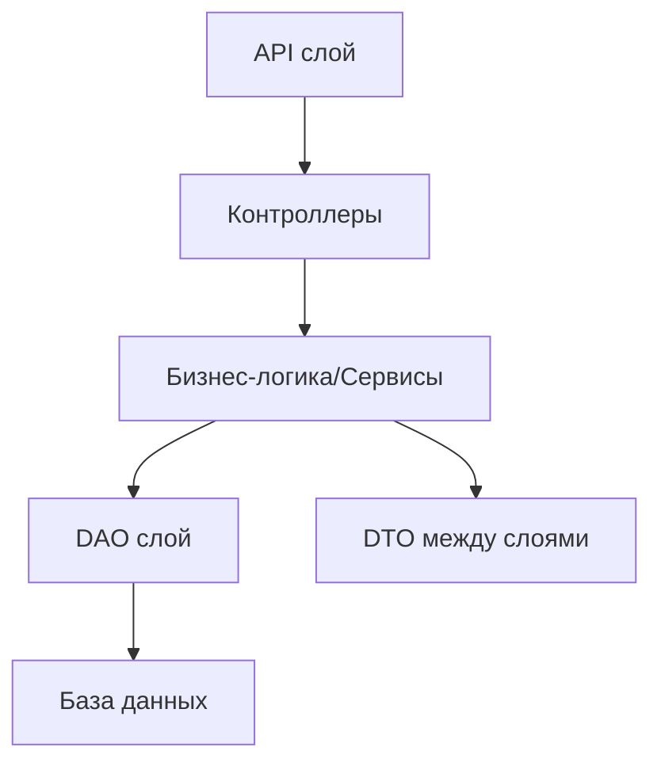

# Архитектура проекта GrantServer

**GrantServer** реализует многослойную архитектуру с чётким разделением бизнес-логики, доступа к данным, сервисов регистрации, обработки заявок, экспертных оценок и служебных модулей.

## Архитектурные принципы

- **Модульность и изоляция:** Каждый бизнес-модуль реализует свою логику через DAO и DTO, общение строго через публичные интерфейсы.
- **Чистая архитектура:** Бизнес-логика отделена от хранения и инфраструктурных сервисов.
- **Строгая типизация:** DTO/DAO, разные типы для каждого бизнес-процесса.
- **Масштабируемость:** Возможность легко добавлять новые сущности (например, дополнительные роли, новые типы заявок или оценки).

***

## Общая схема слоёв

***

## Основные компоненты и их роли

### 1. Participants/Applicants Module

- **Задача:** Регистрация фирм-участников, вход/выход, удаление, управление аккаунтом.
- **DAO/DTO:** ParticipantDAO, ParticipantRegisterDTO, ParticipantDTO
- **Ограничения:** Без двойной регистрации, аккаунт и связанные заявки удаляются полностью.

***

### 2. Experts Module

- **Задача:** Регистрация/авторизация экспертов, указание специализаций, удаление и обработка экспертных оценок.
- **DAO/DTO:** ExpertDAO, ExpertRegisterDTO, ExpertDTO
- **Ограничения:** Без двойной регистрации, аккаунт/оценки удаляются полностью.

***

### 3. Grant Applications Module

- **Задача:** Подача, отмена, получение заявок, фильтрация по полям и владельцам.
- **DAO/DTO:** GrantApplicationDAO, GrantApplicationDTO, GrantApplicationFilterDTO
- **Ограничения:** Внесённая заявка не изменяется, только отменяется.

***

### 4. Evaluation Module

- **Задача:** Выставление экспертных оценок, изменение/удаление оценок, выборка заявок по экспертам и направлениям.
- **DAO/DTO:** EvaluationDAO, EvaluationDTO
- **Ограничения:** Позволяет менять/удалять оценку в любой момент.

***

### 5. Grant Fund \& Calculation Module

- **Задача:** Ранжирование, вычисление и распределение фонда, подведение итогов конкурса по бизнес-алгоритму.
- **DTO:** GrantFundRequestDTO (фонд, порог), аутилизированные DTO для результатов

***

### 6. Auth \& Session Module

- **Задача:** Управление сессиями, авторизация, токены, выход и вход пользователей.
- **DTO:** AuthRequestDTO, AuthResponseDTO
- **Особенности:** Полное разделение аутентификации для экспертов и участников.

***

### 7. Common Services

- **Логирование, конфигурация, обработка ошибок (Singleton/Command/Factory)
- **Реализация утилит для маппинга DTO/Entity и валидации данных.

***

## Взаимодействие модулей

- Каждый бизнес-модуль общается с другими только через сервисы и DTO.
- API слой (контроллеры) перехватывает входящие HTTP-запросы, валидирует, вызывает сервисы бизнес-логики, превращает выход в DTO и отдаёт клиенту.
- DAO слой инкапсулирует работу с БД или другим persistent storage.

***

## Алгоритм подведения итогов

- Сортировка заявок по средней оценке, далее по запрошенной сумме, затем случайным образом;
- Выделение средств по очереди, если хватает фонда и сумма превышает порог;
- Подробная логика алгоритма описана отдельно в бизнес-логике Grant Fund Module.

***

## Принципы тестирования

- Все функции покрываются JUnit-тестами:
    - Тесты регистрации, двойной регистрации, авторизации, обработки ошибок
    - Тесты заявок, оценок, итогового расчёта

***

## Дополнительная документация

- Структура модулей — [`MODULES.md`](./MODULES.md)
- Эндпоинты и DTO — [`API.md`](./API.md)
- Категории и реализации паттернов — [`DESIGN-PATTERNS.md`](./DESIGN-PATTERNS.md)
